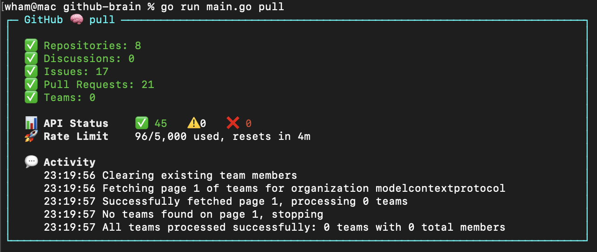

<div align="center">
  
  <h1>GitHub Brain MCP Server</h1>
</div>

**GitHub Brain** is an experimental MCP server for summarizing GitHub discussions, issues, and pull requests. Answer questions like:

- _What are the contributions of user X in the last month?_
- _Summarize this month's discussions._

https://github.com/user-attachments/assets/80910025-9d58-4367-af00-bf4c51e6ce86

GitHub Brain complements (but does not replace) the [official GitHub MCP server](https://github.com/github/github-mcp-server). It stores GitHub data in a local database for:

- Fast responses
- More than the standard 100-item API limit
- Token-efficient Markdown output



GitHub Brain is [programmed in Markdown](https://github.blog/ai-and-ml/generative-ai/spec-driven-development-using-markdown-as-a-programming-language-when-building-with-ai/).

## Installation

```sh
npm i -g github-brain
```

Or use `npx github-brain` to run without installing globally.

## Usage

```sh
github-brain <command> [<args>]
```

**Workflow:**

1. Use `login` to authenticate with GitHub (or set `GITHUB_TOKEN` manually)
2. Use `pull` to populate the local database
3. Use `mcp` to start the MCP server

Re-run `pull` anytime to update the database with new GitHub data.

Each command has its own arguments. Some can be set via environment variables. The app will also load environment variables from a `.env` file in the GitHub Brain's home directory - `~/.github-brain` by default.
You can change the home directory with the `-m` argument available for all commands.

<details>
    <summary>Example .env file</summary>

    GITHUB_TOKEN=your_github_token
    ORGANIZATION=my-org

</details>

### `login`

Opens your browser to authorize _GitHub Brain_ app and stores resulting `GITHUB_TOKEN` in the `.env` file.
Optionally, you can also specify `ORGANIZATION` to store in the same file.

Example:

```sh
github-brain login
```

| Argument | Description                                |
| :------- | :----------------------------------------- |
| `-m`     | Home directory. Default: `~/.github-brain` |

### `pull`

Populate the local database with GitHub data.

Example:

```sh
github-brain pull -o my-org
```

The first run may take a while. Subsequent runs are faster, fetching only new data.

| Argument | Variable                | Description                                                                                                                            |
| :------- | :---------------------- | :------------------------------------------------------------------------------------------------------------------------------------- |
|          | `GITHUB_TOKEN`          | Your GitHub token. Use `login` command or create a [personal token](https://github.com/settings/personal-access-tokens). **Required.** |
| `-o`     | `ORGANIZATION`          | The GitHub organization to pull data from. **Required.**                                                                               |
| `-m`     |                         | Home directory. Default: `~/.github-brain`                                                                                             |
| `-i`     |                         | Pull only selected entities: `repositories`, `discussions`, `issues`, `pull-requests` (comma-separated).                               |
| `-f`     |                         | Remove all data before pulling. With `-i`, removes only specified items.                                                               |
| `-e`     | `EXCLUDED_REPOSITORIES` | Repositories to exclude (comma-separated). Useful for large repos not relevant to your analysis.                                       |

<details>
    <summary>Personal access token scopes</summary>

    Use [fine-grained personal access tokens](https://github.com/settings/personal-access-tokens).

    **Private organizations:** Token needs read access to discussions, issues, metadata, and pull requests. [Generate token](https://github.com/settings/personal-access-tokens/new?name=github-brain&description=http%3A%2F%2Fgithub.com%2Fwham%2Fgithub-brain&issues=read&pull_requests=read&discussions=read).

    **Public organizations:** Any token works (data is publicly accessible).

</details>

### `mcp`

Start the MCP server using the local database.

Example:

```sh
github-brain mcp -o my-org
```

| Argument | Variable       | Description                                 |
| :------- | :------------- | :------------------------------------------ |
| `-o`     | `ORGANIZATION` | GitHub organization. **Required.**                                                           |
| `-m`     |                | Home directory. Default: `~/.github-brain`                                                   |

### Additional Arguments

**Version:**

```sh
github-brain --version
```

Displays the current version (commit hash and build date).

## MCP Configuration

### Claude

Add to the Claude MCP configuration file:

```json
{
  "mcpServers": {
    "github-brain": {
      "type": "stdio",
      "command": "github-brain",
      "args": ["mcp"]
    }
}
```

Merge with existing `mcpServers` if present.

### VS Code

Add to the VS Code MCP configuration file:

```json
{
  "servers": {
    "github-brain": {
      "type": "stdio",
      "command": "github-brain",
      "args": ["mcp"],
      "version": "0.0.1"
    }
  }
}
```

Merge with existing `servers` if present.

## Development

`scripts/run` builds and runs `github-brain` with the checkout directory as home `-m` (database in `db/`, config in `.env`).
